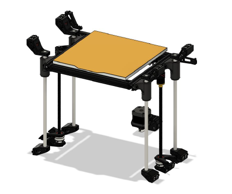
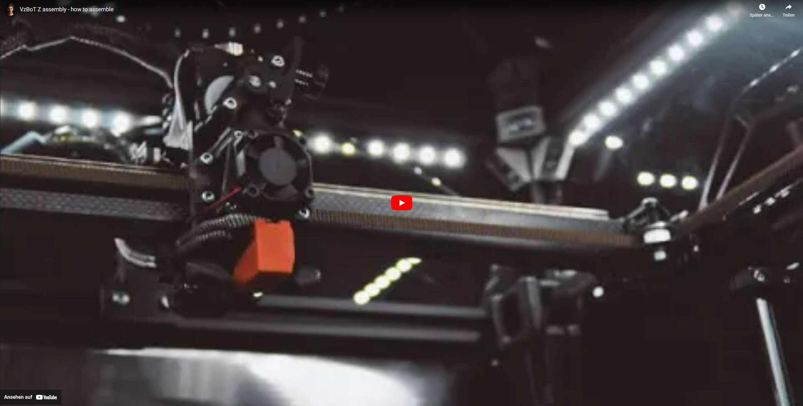
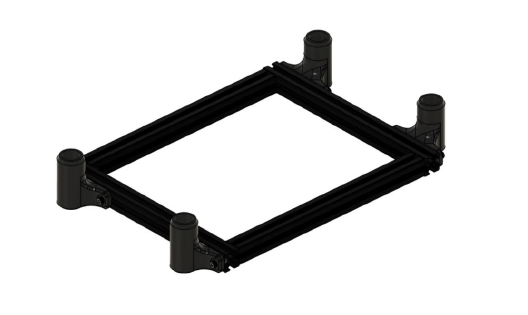
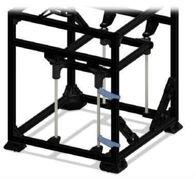
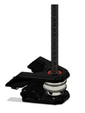
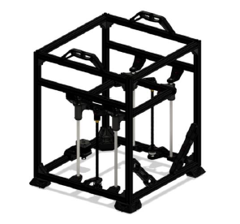
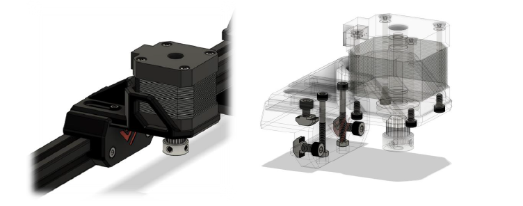
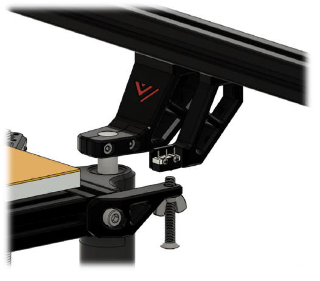

# 2. Z - Assembly & Bed

## Overview

 
 

The proper alignment procedure of the VZ235 is the same as on the VZ330 only difference is the length of the alignment tools. Make sure to check out the YouTube video explaining how to align your Z-assembly, so it is both smooth and lines up with the possible travel of the printhead.
### Video tutorial

## BOM

| Material        | Quantity          | Notes |
|:-------------|:------------------|:------|
| M3 6mm           | 4 | -  |
| M3 15mm | 24   | -  |
| M3 20mm           | 4      | - |
| M3 30mm | - | 2 |
| M3 30mm countersunk | 5 | - |
| M3 nut | 28 | - |
| M3 t-nut           | 2 | -  |
| M3 wing nuts           | 5 | -  |
| M4 10mm           | 47 | - |
| M4 8mm | 1 | - |
| M4 t-nut | 47 | - |
| M5/M6 20mm           | 2 | Depending on extrusion type  |
| M5 10/8mm | 8 | Depending on the 2020 corner bracket |
| 2020 corner bracket | 4 | - |
| 245mm 2020 extrusion | 2 | - |
| 232mm 2020 extrusion | 2 | - |
| 300mm leadscrew T8 | 2 | - |
| Leadscrew nut | 2 | - |
| 300mm 10mm smooth rod | 4 | Optional size, also supports 8 and 12mm as found on VZ330 |
| LMU10LUU bearing | 4 | - |
| 608-2RS bearing | 4 | - |
| GT2 40T 8mm pulley | 2 | - |
| NEMA17 Motor | 1 | - |
| GT2 20T Pulley | 1 | - |
| 850-890mm looped belt | 1 | - |
| Ender 3 bed / machined aluminum bed | 1 | - |
| Bed Springs | 4 | - |
| Microswitch | 1 | - |

## STL

| File name | Amount to print |
|-----------|-----------------|
| <a href="https://github.com/VzBoT3D/VzBoT-Vz235/blob/main/Assemblies%20%26%20STL/Frame/Frame%20brace.stl" target="_blank">Z lower rod mount main</a> | 4 |
| <a href="https://github.com/VzBoT3D/VzBoT-Vz235/blob/main/Assemblies%20%26%20STL/Frame/Frame%20brace.stl" target="_blank">Z lower rod mount clamp</a> | 4 |
| <a href="https://github.com/VzBoT3D/VzBoT-Vz235/blob/main/Assemblies%20%26%20STL/Frame/Frame%20brace.stl" target="_blank">Z upper rod mount main</a> | 4 |
| <a href="https://github.com/VzBoT3D/VzBoT-Vz235/blob/main/Assemblies%20%26%20STL/Frame/Frame%20brace.stl" target="_blank">Z upper rod mount clamp</a> | 4 |
| <a href="https://github.com/VzBoT3D/VzBoT-Vz235/blob/main/Assemblies%20%26%20STL/Frame/Frame%20brace.stl" target="_blank">Single z motor bracket upper</a> | 1 |
| <a href="https://github.com/VzBoT3D/VzBoT-Vz235/blob/main/Assemblies%20%26%20STL/Frame/Frame%20brace.stl" target="_blank">Single z motor bracket lower</a> | 1 |
| <a href="https://github.com/VzBoT3D/VzBoT-Vz235/blob/main/Assemblies%20%26%20STL/Frame/Frame%20brace.stl" target="_blank">Lead screw upper bracket</a> | 2 |
| <a href="https://github.com/VzBoT3D/VzBoT-Vz235/blob/main/Assemblies%20%26%20STL/Frame/Frame%20brace.stl" target="_blank">Lead screw lower bracket</a> | 2 |
| <a href="https://github.com/VzBoT3D/VzBoT-Vz235/blob/main/Assemblies%20%26%20STL/Frame/Frame%20brace.stl" target="_blank">Limit switch mount</a> | 1 |
| <a href="https://github.com/VzBoT3D/VzBoT-Vz235/blob/main/Assemblies%20%26%20STL/Frame/Frame%20brace.stl" target="_blank">Z stopper</a> | 1 |
| <a href="https://github.com/VzBoT3D/VzBoT-Vz235/blob/main/Assemblies%20%26%20STL/Frame/Frame%20brace.stl" target="_blank">Z chain mount</a> | 1 |
| <a href="https://github.com/VzBoT3D/VzBoT-Vz235/blob/main/Assemblies%20%26%20STL/Frame/Frame%20brace.stl" target="_blank">Bearing mount</a> | 4 |
| <a href="https://github.com/VzBoT3D/VzBoT-Vz235/blob/main/Assemblies%20%26%20STL/Frame/Frame%20brace.stl" target="_blank">Leadscrew support</a> | 2 |
| <a href="https://github.com/VzBoT3D/VzBoT-Vz235/blob/main/Assemblies%20%26%20STL/Frame/Frame%20brace.stl" target="_blank">Oldham coupler (all parts)</a> | 2 |
| <a href="https://github.com/VzBoT3D/VzBoT-Vz235/blob/main/Assemblies%20%26%20STL/Frame/Frame%20brace.stl" target="_blank">Bed M3 support</a> | 4 |
| <a href="https://github.com/VzBoT3D/VzBoT-Vz235/blob/main/Assemblies%20%26%20STL/Frame/Frame%20brace.stl" target="_blank">Z alignment tool</a> | 2 |

### Step 1

First assemble your bed assembly, make sure the bed frame is on a flat surface when assembling. Insert the linear bearings in their brackets and attach them to the bed frame. Do make sure the brackets are on the most outer position of the frame like shown below and that they are flat with the frame. Do not attach the printer bed to the frame yet.
 
 

 

### Step 2

Attach all rod holders finger tight (upper & lower) to the frame, don’t worry about the position just yet. You want to be able to shift them around. Then insert the rods into the bearings and attach the bed frame with the rods to the respective rod holders.

### Step 3

With the assembly in place attach the two alignment tools like shown below and tighten
 
 

 

### Step 4

Once you aligned the front corners you are going to put the bed in the lowest position and wiggle the bed around. Try to get the rod pretty nice and vertical to the frame and tighten the rear bottom rod holders and tighten them to the frame.

### Step 5

Now put the bed in the highest position and tighten the clamps for the upper rods and tighten the brackets to the frame. To keep the bed up you can use zip ties or ask someone to help.

### Step 6

Insert the bearings in the leadscrew brackets (press fit) and attach the brackets like shown below. Don’t forget to put the belt around the pulley before assembling the top part of the bracket.
 
 

 

Then attach the leadscrew support with the oldham couplers and leadscrew nut to the bed frame and assemble the parts loosely.
 
 

 

### Step 7

To align the parts, measure the bracket is nicely in between the rod holders measure the distance and get it approximately centered. Turn the leadscrew a bit to help it self-align the upper leadscrew support on the bed and tighten the parts. The leadscrew should be nice and vertical. To check you can put the bed in the highest position and measure the distances between the leadscrew and z rod. The leadscrew should now be centered between both z rods.

### Step 8

Attach the single motor mount like shown below
 
 

 

The top M3 screws are 30mm and lock the sliding mechanism in place. They also serve as reinforcement of the mount. Also attach the motor pulley and belt on the motor.

### Step 9

To synchronize the leadscrews, turn out the grub screws on the 40t pulleys and get the bed in the top position. Then retighten the grubscrews

### Step 10

Assemble the z switch and make sure when the bed rises the switch is triggered by the screw to avoid a bed crash at the first homing sequence.
 
 

 

### Step 11

Finally install the bed M3 supports, attach the bed with the countersunk M3’s and bed springs. If you are using a milled aluminum bed refer to the electronics/wiring section on how to properly assemble the silicone heater pad.