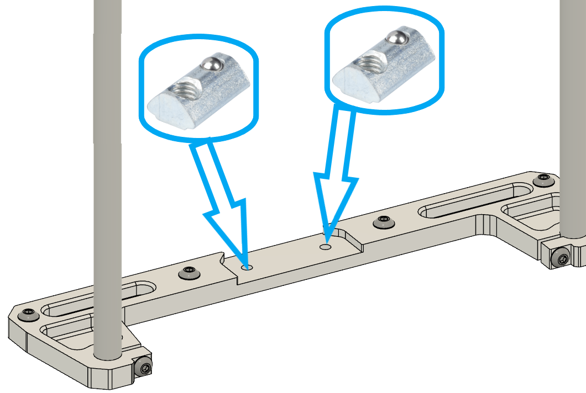
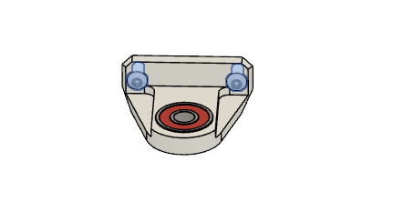
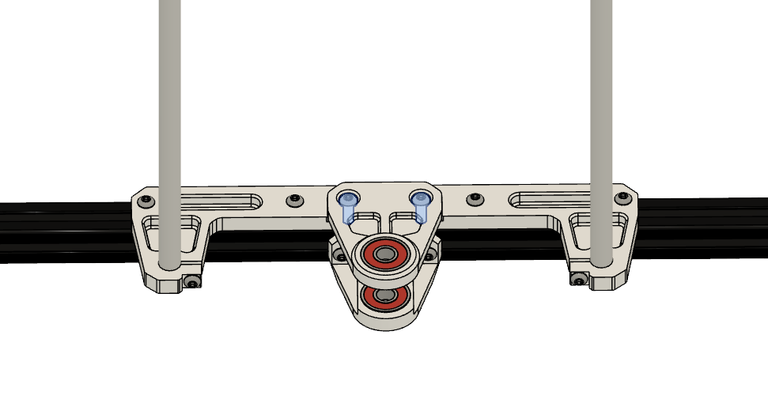
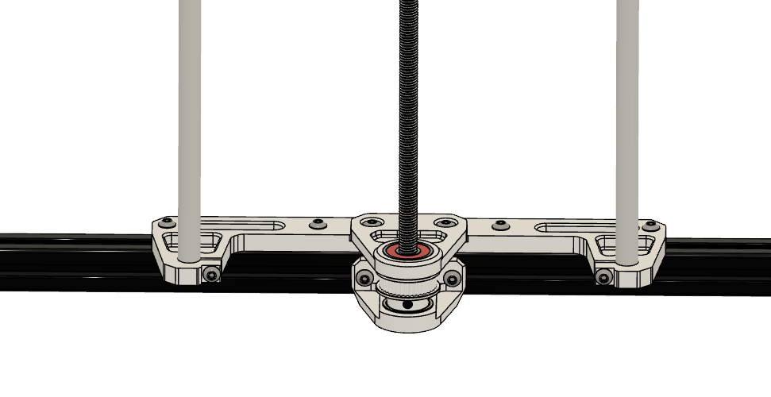

# 3.1 Lower rod & leadscrew bracket

## Overview

## BOM

| Material        | Quantity          | Notes |
|:-------------|:------------------|:------|
| M4 10mm           | 4 | -  |
| M4 12mm | 16   | -  |
| M4 t-nut | 20 | - |
| 608-2RS bearings | 4 | - |
| 10mm rods ( 500mm ) | 4 | - |
| Belt GT2 closed ( 1100mm ) | 1 | - |
| Leadscrew TR8 ( 500 mm ) | 2 | - |
| GT2 40 teeth | 2 | - |
| GT2 20 teeth | 1 | - |

## STL's

| File name | Amount to print |
|-----------|-----------------|
| <a href="https://github.com/VzBoT3D/VzBoT-Vz330/blob/master/Assemblies%20BOM%20and%20STL/Alignment%20Tools/Z%20Alignment%20tool%2010mm%20rod.stl" target="_blank">Z alignment tool</a> | 2 |

### Step 1 (do for each side)

 
 

| | |
|-|-|
|  | 1) 2 x lower z bracket    2) 4 x M4 x 12mm   3) 4 x 10mm rods |
|  | 1) Align the rod flush with the bottom of the lower z bracket |
|  | 1) Tighten the M4 x 12mm screw |

 
 

### Step 2 (do for each side)

 
 

| | |
|-|-|
|  | 1) 2 x lower z bracket    2) 8 x M4 x 12mm   3) 8 x t-nut   4) 4 x sliding t-nut |
|  | 1) Insert sliding t-nut in the extrusion below the middle two holes | 
|  | 1) Attach M4 x 12mm + t-nut to the lower z bracket   2) **Tip:** screw in two screws for now in the two holes and the sliding t-nuts so they move with the part if you move it around. |
|  | 1) Tighten the M4 x 12mm screw loosly, we need to align the lower z bracket |
|  | 1) Align the front rod with the z-alignment tool   2) tighten the M4 x 12mm screws, when it's aligned |

 
 

### Step 3 (do for each side)

| | |
|-|-|
|  | 1) 2 x lower leadscrew mount    2) 4 x M4 x 12mm   3) 4 x t-nut  |
|  | 1) Attach M4 x 12mm + t-nut to the lower leadscrew mount |
|  | 1) Insert lower leadscrew mount to bottom extrusion   2) Tighten the M4 x 12mm screw loosly, and center the lower leadscrew mount   3) We will align the parts in **Step 5** |

 
 

### Step 4 (do for each side)

| | |
|-|-|
|  | 1) 2 x upper leadscrew mount    2) 4 x M4 x 12mm  |
|  | 1) Insert upper leadscrew mount to single z bracket   2) Tighten the M4 x 12mm screw loosly, and center the lower leadscrew mount   3) Use a drill bit or a similar tool, put it through the two bearing's and prealign the two mounts   4) We will align the parts in **Step 5** |

 
 

### Step 5 (do for each side)

| | |
|-|-|
|  | 1) 2 x leadscrew    2) 2 x GT2 40 tooth idler   3) 1 x closed GT2 belt ( 1100mm )  |
|  | 1) Insert closed GT2 belt between lower and upper leadscrew mount   2) Insert GT2 40 tooth idler between lower and upper leadscrew mount (the beld should be around the idler )   3) Insert leadscrew   4) Secure leadscrew with grub screws of the GT2 idler (leadscrew shouldn't rub on the ground)   5) Check that leadscrew is straight and tighten upper and lower leadscrew bracket |

 
 